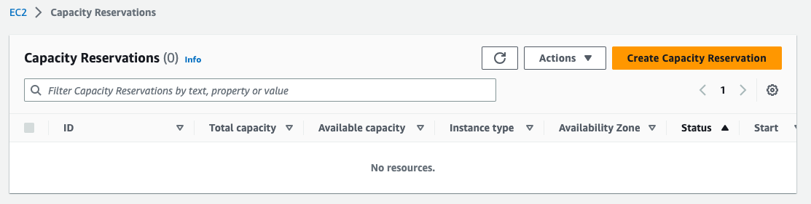

# terraform-aws-ec2-capacity-reservation
[](https://github.com/haidargit/terraform-aws-ec2-capacity-reservation/releases/latest)

<a href="https://aws.amazon.com/console/"></a>&emsp;
<a href="https://aws.amazon.com/ec2/"></a>&emsp;
<a href="https://registry.terraform.io/"></a>

Terraform module to provision [AWS EC2 On-Demand Capacity Reservations](https://docs.aws.amazon.com/AWSEC2/latest/UserGuide/ec2-capacity-reservations.html)

---

This module is part of [haidar's Terraform Registry](https://registry.terraform.io/namespaces/haidargit) compilation. Open Source licensed under the [APACHE2](LICENSE).  
<br/>

[][share_reddit]
[][share_linkedin]
[][share_twitter]
[][share_facebook]
[][share_email]


## Usage

We refrain from fixing module versions in the module examples. It is strongly advised that you explicitly specify the version in your code to match the exact version you are working with. This ensures the stability of your infrastructure while allowing for systematic version updates.

To use this module into your projects, you can try with one:

```hcl
module "ec2_capacity_reservation" {
  source = "haidargit/ec2-capacity-reservation/aws"
  version = "1.0.0"

  on_demand_reservation_instance_type           = var.on_demand_reservation_instance_type
  on_demand_reservation_ebs_optimized           = var.on_demand_reservation_ebs_optimized
  on_demand_reservation_instance_platform       = var.on_demand_reservation_instance_platform
  on_demand_reservation_availability_zone       = var.on_demand_reservation_availability_zone
  on_demand_reservation_instance_count          = var.on_demand_reservation_instance_count
  on_demand_reservation_end_date                = timeadd(timestamp(), var.on_demand_reservation_end_date)
  on_demand_reservation_instance_match_criteria = var.on_demand_reservation_instance_match_criteria
  tags                                          = var.tags
}
```

## Examples

### Complete Examples

Here is an example of using this module:
- [`examples/complete`](https://github.com/haidargit/terraform-aws-ec2-capacity-reservation/) - complete example of using this module

### AWS Console (Screenshot)

**Before**
  

**After**


## Requirements

| Name | Version |
|------|---------|
| <a name="requirement_terraform"></a> [terraform](#requirement\_terraform) | >= 1.0.0 |
| <a name="requirement_aws"></a> [aws](#requirement\_aws) | >= 4.0 |

## Providers

| Name | Version |
|------|---------|
| <a name="provider_aws"></a> [aws](#provider\_aws) | >= 4.0 |

## Resources

| Name | Type |
|------|------|
| [aws_ec2_capacity_reservation.default](https://registry.terraform.io/providers/hashicorp/aws/latest/docs/resources/ec2_capacity_reservation) | resource |

## Inputs

| Name | Description | Type | Default | Required |
|------|-------------|------|---------|:--------:|
| <a name="input_on_demand_reservation_instance_type"></a> [on\_demand\_reservation\_instance\_type](#input\_on\_demand\_reservation\_instance\_type) | The instance type for which to reserve capacity | `string` | `t2.micro` | no |
| <a name="input_on_demand_reservation_ebs_optimized"></a> [on\_demand\_reservation\_ebs\_optimized](#input\_on\_demand\_reservation\_ebs\_optimized) | Indicates whether the Capacity Reservation supports EBS-optimized instances. If the selected instance type's reservation is EBS-optimized by default, we will not able to use non EBS-optimized option (i.e. `false` value). | `bool` | `true` | no |
| <a name="input_ephemeral_storage"></a> [ephemeral\_storage](#input\_ephemeral\_storage) | Indicates whether the Capacity Reservation supports instances with temporary, block-level storage. | `bool` | `false` | no |
| <a name="input_on_demand_reservation_instance_platform"></a> [on\_demand\_reservation\_instance\_platform](#input\_on\_demand\_reservation\_instance\_platform) | The type of operating system for which to reserve capacity | `string` | `Linux/UNIX` | no |
| <a name="input_on_demand_reservation_availability_zone"></a> [on\_demand\_reservation\_availability\_zone](#input\_on\_demand\_reservation\_availability\_zone) | Availability Zone the instance is launched in. If not set, will be launched in the first AZ of the region | `string` | `""` | no |
| <a name="input_on_demand_reservation_tenancy"></a> [on\_demand\_reservation\_tenancy](#input\_on\_demand\_reservation\_tenancy) | Indicates the tenancy of the Capacity Reservation. Specify either `default` or `dedicated`. A tenancy of 'default' runs on shared hardware, while 'dedicated' runs on a dedicated instance. Valid values are 'default' and 'dedicated'. | `string` | `default` | no |
| <a name="input_on_demand_reservation_instance_count"></a> [on\_demand\_reservation\_instance\_count](#input\_on\_demand\_reservation\_instance\_count) | The number of On-Demand instance quotas for which to reserve capacity | `number` | `1` | no |
| <a name="input_on_demand_reservation_end_date"></a> [on\_demand\_reservation\_end\_date](#input\_on\_demand\_reservation\_end\_date) | Capacity Reservation expires in hour(s). When a Capacity Reservation expires, the reserved capacity is released and you can no longer launch instances into it. Valid values `YYYY-MM-DDTHH:MM:SSZ` | `string` | `3h` | no |
| <a name="input_on_demand_reservation_end_date_type"></a> [on\_demand\_reservation\_end\_date\_type](#input\_on\_demand\_reservation\_end\_date\_type) | Indicates the way in which the Capacity Reservation ends. Specify either `unlimited` or `limited`. if the capacity reservation has no end date or `unlimited`. It will remain active in your account and continue to be billed until you manually cancel it or destroy thi resource. | `string` | `limited` | no |
| <a name="input_on_demand_reservation_instance_match_criteria"></a> [on\_demand\_reservation\_instance\_match\_criteria](#input\_on\_demand\_reservation\_instance\_match\_criteria) | Indicates the type of instance launches that the Capacity Reservation accepts. Specify either `open` or `targeted`. | `string` | `targeted` | no |
| <a name="input_tags"></a> [tags](#input\_tags) | Tags (e.g. `{"Environment": "ProductionTest"}`). | `map(string)` | `{}` | no |

## Outputs

| Name | Description |
|------|-------------|
| <a name="output_ec2_capacity_reservation_id"></a> [ec2\_capacity\_reservation\_id](#output\_ec2\_capacity\_reservation\_id) | The Capacity Reservation ID |
| <a name="output_ec2_capacity_reservation_owner_id"></a> [ec2\_capacity\_reservation\_owner\_id](#output\_ec2\_capacity\_reservation\_owner\_id) | The ID of the AWS account that owns the Capacity Reservation |
| <a name="output_ec2_capacity_reservation_arn"></a> [ec2\_capacity\_reservation\_arn](#output\_ec2\_capacity\_reservation\_arn) | The ARN of the Capacity Reservation |
| <a name="output_ec2_capacity_reservation_tags_all"></a> [ec2\_capacity\_reservation\_tags\_all](#output\_ec2\_capacity\_reservation\_tags\_all) | A map of tags assigned to the resource, including those inherited from the provider `default_tags` configuration block |

## References

To gain additional context.
[](#references)

- [Terraform Standard Module Structure](https://www.terraform.io/docs/modules/index.html#standard-module-structure) - HashiCorp's standard module structure is a file and directory layout we recommend for reusable modules distributed in separate repositories.
- [Terraform Module Requirements](https://www.terraform.io/docs/registry/modules/publish.html#requirements) - HashiCorp provides clear guidance on meeting all the prerequisites for publishing a module
- [Terraform Version Pinning](https://www.terraform.io/docs/configuration/terraform.html#specifying-a-required-terraform-version) - Utilizing the `required_version` setting, you can define the Terraform CLI versions that are compatible with your configuration.


## Contributing

### Bug Reports & Feature Requests

If you encounter any bugs or have suggestions for new features, kindly utilize the [issue tracker](https://github.com/haidargit/terraform-aws-ec2-capacity-reservation/issues) for reporting.

### Pull Request

Feel free to contribute by submitting pull requests. Here's how:

 1. **Fork** this repository on GitHub
 2. **Clone** the repository to your local machine
 3. **Commit** changes on a seperate branch (make a new branch)
 4. **Push** your changes to your forked repository
 5. Submit a **Pull Request** ✅

👍 It's essential to sync your branch with the latest changes from the "upstream" before you create a pull request.

## License

[](https://opensource.org/licenses/Apache-2.0)

See [LICENSE](LICENSE) for full details.

```text
Licensed to the Apache Software Foundation (ASF) under one
or more contributor license agreements.  See the NOTICE file
distributed with this work for additional information
regarding copyright ownership.  The ASF licenses this file
to you under the Apache License, Version 2.0 (the
"License"); you may not use this file except in compliance
with the License.  You may obtain a copy of the License at

  https://www.apache.org/licenses/LICENSE-2.0

Unless required by applicable law or agreed to in writing,
software distributed under the License is distributed on an
"AS IS" BASIS, WITHOUT WARRANTIES OR CONDITIONS OF ANY
KIND, either express or implied.  See the License for the
specific language governing permissions and limitations
under the License.
```

## Trademarks

The trademarks mentioned here are owned by their respective owners.

## About

This module is maintained by [haidar][github].


  [github]: https://github.com/haidargit
  [terraform_modules]: https://cpco.io/terraform-modules?utm_source=github&utm_medium=readme&utm_campaign=cloudposse/terraform-aws-msk-apache-kafka-cluster&utm_content=terraform_modules
  [share_twitter]: https://twitter.com/intent/tweet/?text=terraform-aws-ec2-capacity-reservation&url=https://github.com/haidargit/terraform-aws-ec2-capacity-reservation
  [share_linkedin]: https://www.linkedin.com/shareArticle?mini=true&title=terraform-aws-ec2-capacity-reservation&url=https://github.com/haidargit/terraform-aws-ec2-capacity-reservation
  [share_reddit]: https://reddit.com/submit/?url=https://github.com/haidargit/terraform-aws-ec2-capacity-reservation
  [share_facebook]: https://facebook.com/sharer/sharer.php?u=https://github.com/haidargit/terraform-aws-ec2-capacity-reservation
  [share_email]: mailto:?subject=terraform-aws-ec2-capacity-reservation&body=https://github.com/haidargit/terraform-aws-ec2-capacity-reservation
